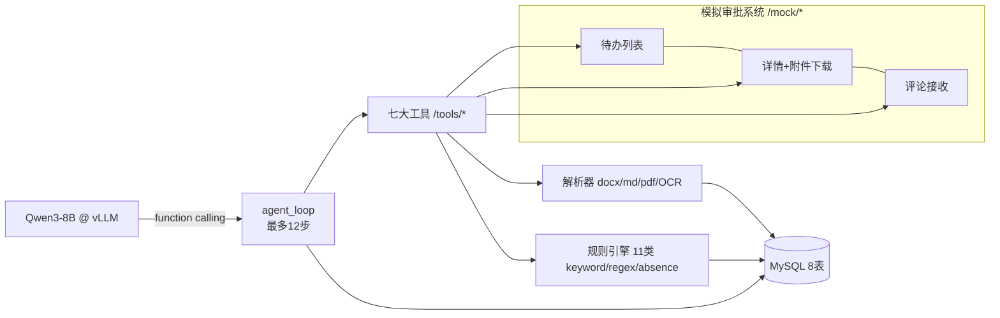

# contract-review-agent · 合同审批审查 Agent

> 七大工具 × Function-Calling 循环 × 规则引擎 —— 合同风险自动审查并回写审批评论区

对应《大模型项目实战》§2.4。复用 kb-platform 的工程地基（FastAPI / MySQL / compose /
测试模式），核心差异：**无 RAG、无向量库**，主打 **工具调用 Agent + 规则引擎 + 状态机**。

## 架构一图流



## 快速启动

```bash
cp deploy/.env.example .env       # 填 LLM_BASE_URL（GPU 开机时）
cd deploy && docker compose up -d --build
docker compose exec app python -m app.tools.bootstrap   # 灌规则库+注册mock审批单
```

## 一键闭环演示

```bash
docker compose exec app python -m app.tools.demo   # 彩色输出五阶段全过程
```

## 文档

[docs/需求覆盖验证报告.md](docs/需求覆盖验证报告.md) · [docs/开发手册.md](docs/开发手册.md)
