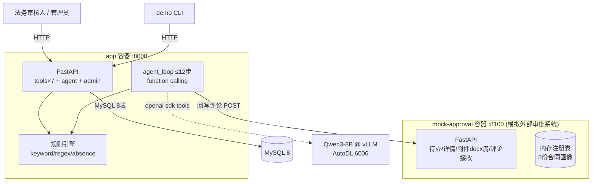

# 软件架构文档（SAD）— 合同审批审查 Agent

| 项 | 内容 |
|----|------|
| 版本 | v1.0 |
| 上游 | docs/SRD.md |

## 1. 总体架构（双服务）

**信任边界**：mock-approval 视 app 为唯一客户端（内网）；app 的管理面由 Admin Token 保护；Agent 对外仅访问 vLLM 与 mock。

## 2. 架构决策记录（ADR）

### ADR-B1 模拟审批系统独立成容器
外部审批系统在真实企业中是独立子系统。独立容器使「评论回写」成为真正的跨服务 HTTP POST，附件下载走真实 HTTP 流——闭环演示与生产形态同构。备选（进程内路由）被否决：说服力弱。

### ADR-B2 OCR 选型 tesseract(chi_sim)
验收要求解析图片扫描件。Qwen3-8B 无视觉能力；tesseract 容器内集成成本最低。中文印刷体识别率满足演示。局限：手写/低质量图片识别差 → 走 blocked 流程（恰好演示阻塞机制）。

### ADR-B3 规则引擎三模式
keyword（命中即风险）/ regex（数值与比例提取，如预付款>30%）/ absence（缺失探测：八类条款关键词组均未出现即触发）。absence 是"验收标准缺失、保密缺失"类规则的唯一可行实现。

### ADR-B4 Agent 循环上限 12 步 + 强制兜底回写
防模型发散或死循环。步数耗尽仍未回写时，系统直接以已采集的结构化结果执行 write_approval_comment 兜底路径，保证闭环必然收敛。

### ADR-B5 LLM 降级策略
vLLM 不可用时：跳过 LLM 字段增强与摘要润色，使用正则提取结果 + 模板化审查意见，闭环继续。GPU 仅提升表达质量，不是可用性依赖。

### ADR-B6 认证模型
工具面与 Agent 面为内网自动化调用，不设用户 JWT；管理面（规则编辑/日志/重试）用 `X-Admin-Token` 常量时间比较保护。Web 工作台只读，无鉴权（演示定位），生产需接入 SSO。

## 3. 存储职责隔离

| 介质 | 职责 | 禁止 |
|------|------|------|
| MySQL | 八表事实源 | 不存文件本体 |
| 本地盘 attachments/ | 下载的合同文件暂存 | 解析后非权威 |
| mock 内存注册表 | 外部审批单仿真状态 | 重启即复位（reset 端点可复现演示） |

## 4. 部署视图

双容器 + 共享网络 cranet；MySQL 数据卷持久化；app:18000 为唯一宿主入口（web 简易页同源挂载）。
