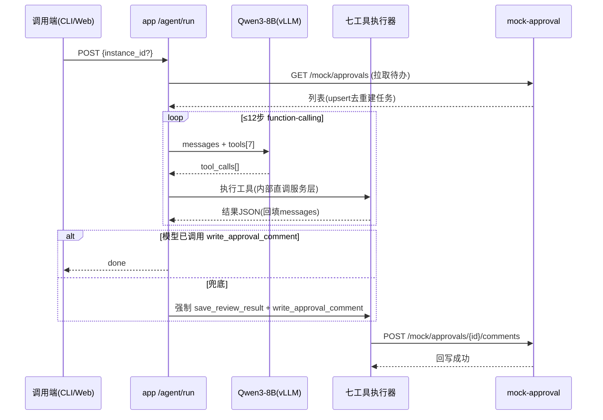

# 软件详细设计文档（SDD）— 合同审批审查 Agent

| 项 | 内容 |
|----|------|
| 版本 | v1.0 |
| 上游 | SRD / SAD |

## 1. 服务与模块划分

```
mock-approval/            app/
├── main.py               ├── main.py
├── store.py  内存注册表   ├── api/
├── contracts_def.py      │   ├── tools.py      七工具
│   (5份合同画像JSON)      │   ├── agent.py     run/retry/tasks/logs
└── Dockerfile            │   ├── mock_proxy.py 模拟系统路由挂载
                          │   └── admin.py     规则/日志/重试(Admin Token)
                          ├── services/
                          │   ├── fetcher.py    拉取去重
                          │   ├── downloader.py 附件下载
                          │   ├── parser.py     解析+结构化(已建)
                          │   ├── rule_engine.py 三模式匹配
                          │   ├── reviewer.py   风险汇总+评论生成(LLM/模板)
                          │   └── agent_loop.py function-calling 循环
                          └── tools_registry.py 七工具 schema 与执行器映射
```

web/（S6 简易页）：Vue3 复用 kb 模式，三个页面：待审任务列表、任务详情（解析字段+命中+回写状态）、规则管理。

## 2. Agent 闭环时序图（主链路）



**blocked 分支**：附件下载失败/解析空/OCR失败 → task=blocked(+reason) → 循环终止 → POST /tasks/{id}/retry 可回 parsing。

## 3. 七工具 Schema（暴露给模型的 JSON 定义，签名对齐规范 §2.4.10）

| 工具 | 参数 | 返回要点 |
|------|------|---------|
| list_pending_contract_approvals | limit | [{approval_code,title,applicant,apply_time,attachment_count}] |
| get_contract_approval | instance_id | {审批信息,表单数据,附件[],状态} |
| download_contract_attachment | instance_id, attachment_id, file_name | {local_path, sha256} |
| parse_contract_document | document_id(=task_id) | {basic_info{}, clauses{}, parse_status} |
| run_contract_rules | case_id(=task_id) | {hits[], overall_risk_level, focus_points[]} |
| save_review_result | case_id, overall_risk_level, summary_text, focus_points_json, comment_text | {result_id} |
| write_approval_comment | instance_id, review_id | {write_status:"success", comment_id} |

## 4. 规则库种子（11 类，规范 §2.4.6）

| rule_code | 名称 | 级别 | mode | 匹配逻辑 |
|-----------|------|------|------|---------|
| PAY_ADVANCE_HIGH | 预付款比例过高 | high | regex | `预付[^。]{0,10}?([0-9]+)%` capture≥30 命中 |
| PAY_CYCLE_LONG | 付款周期过长 | medium | regex | `(?:验收合格后|交付后)\s*([0-9]+)\s*(?:个)?工作日(?:内)?支付` ≥60 |
| AUTO_RENEW | 自动续约条款 | medium | keyword | 自动续约,自动延长,期满自动 |
| NO_BREACH | 违约责任缺失 | high | absence | 违约,赔偿,责任 |
| JURISDICTION_RISK | 管辖地不利 | medium | regex | `管辖.*?(原告|被告|我方|对方|供方).*?所在地` |
| PARTY_MISSING | 主体信息缺失 | high | absence | 统一社会信用代码,营业执照 |
| AMOUNT_MISSING | 合同金额缺失 | high | absence | 合同金额,总价,合同总价款 |
| NDA_MISSING | 保密条款缺失 | medium | absence | 保密,机密 |
| DATA_COMPLIANCE | 数据处理合规提示 | low | keyword | 个人信息,数据安全,数据保护 |
| IP_MISSING | 知识产权归属缺失 | medium | absence | 知识产权,著作权,成果归属 |
| ACCEPTANCE_MISSING | 验收标准缺失 | high | absence | 验收,检验标准 |

absence 语义：match_text 逗号分隔关键词组，**全部**未出现即命中（缺失即风险）。
汇总规则：overall = max(命中级别)；无命中 → low；关注点 = 各命中 suggestion_text。

## 4.1 API 清单（全集）

| 面 | 路由 | 说明 |
|----|------|------|
| 工具面 | POST /tools/list_pending · /tools/get_approval · /tools/download_attachment · /tools/parse_document · /tools/run_rules · /tools/save_result · /tools/write_comment | 七工具（Agent 与 CLI 共用） |
| Agent 面 | POST /agent/run · GET /agent/tasks · GET /agent/tasks/{id} · POST /agent/tasks/{id}/retry · GET /agent/tasks/{id}/logs | 触发闭环/查询/重试/日志 |
| Mock 面(内网) | GET /mock/approvals · GET /mock/approvals/{iid} · GET /mock/approvals/{iid}/attachments/{aid} · POST /mock/approvals/{iid}/comments · POST /mock/reset | 外部审批系统仿真 |
| 管理面 | GET/PUT /admin/rules · GET /admin/logs/{task_id} · POST /admin/reset-demo（X-Admin-Token） | 系统管理员 |
| 健康 | GET /health | 存活探针 |

## 5. 错误处理矩阵（blocked 触发面）

| 环节 | 异常 | 行为 |
|------|------|------|
| 下载 | 文件不存在/mock 不可达 | blocked(block_reason) 可重试 |
| 解析 | PDF 无文字层且非扫描路径 | 尝试 OCR → 仍失败 blocked |
| OCR | 图片空白/识别率低 | blocked（演示阻塞用例） |
| 规则 | 正则编译异常 | 该规则 error 跳过，不阻断整体 |
| 回写 | mock 评论接口 5xx | write_status=failed + blocked 可重试 |

## 6. 配置项

见 deploy/.env.example（MYSQL_URL / LLM_* / ADMIN_TOKEN / UPLOAD_DIR / TESSERACT_CMD / OCR_LANG）。
