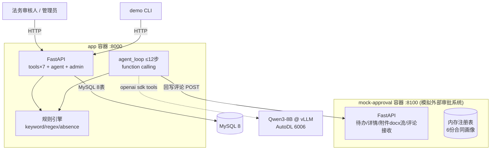

# 软件架构文档（SAD）— 合同审批审查 Agent

> [!NOTE]
> 本文描述 **main v1.x 基线**。分支 feat/langchain-react-gpu-only（V2：LangChain ReAct、十工具、零降级、重试即真跑引擎等）的行为差异以 [V2分支现状.md](../V2分支现状.md) 为准，冲突处以该文档为准。

| 项 | 内容 |
|----|------|
| 版本 | v1.1（对齐复核修订） |
| 上游 | docs/srd/SRD.md |

> v1.1 变更：新增 ADR-B7 混合 Function-Calling 路径；§4 部署视图扩展云端部署形态；勘误 mock 合同画像数量（5→6）。

## 1. 总体架构（双服务）

**信任边界**：mock-approval 视 app 为唯一客户端（内网）；app 的管理面由 Admin Token 保护；Agent 对外仅访问 vLLM 与 mock。

## 2. 架构决策记录（ADR）

### ADR-B1 模拟审批系统独立成容器
外部审批系统在真实企业中是独立子系统。独立容器使「评论回写」成为真正的跨服务 HTTP POST，附件下载走真实 HTTP 流——闭环演示与生产形态同构。备选（进程内路由）被否决：说服力弱。

### ADR-B2 OCR 选型 tesseract(chi_sim)
验收要求解析图片扫描件。Qwen3-8B 无视觉能力；tesseract 容器内集成成本最低。中文印刷体识别率满足演示。局限：手写/低质量图片识别差 → 走 blocked 流程（恰好演示阻塞机制）。

### ADR-B3 规则引擎三模式
keyword（命中即风险）/ regex（数值与比例提取，如预付款>30%）/ absence（缺失探测：八类条款关键词组均未出现即触发）。absence 是"验收标准缺失、保密缺失"类规则的唯一可行实现。

### ADR-B4 Agent 循环上限 12 步 + 强制兜底回写
防模型发散或死循环。步数耗尽仍未回写时，系统直接以已采集的结构化结果执行 write_approval_comment 兜底路径，保证闭环必然收敛。

### ADR-B5 LLM 降级策略
vLLM 不可用时：跳过 LLM 字段增强与摘要润色，使用正则提取结果 + 模板化审查意见，闭环继续。GPU 仅提升表达质量，不是可用性依赖。

### ADR-B6 认证模型
工具面与 Agent 面为内网自动化调用，不设用户 JWT；管理面（规则编辑/日志/重试）用 `X-Admin-Token` 常量时间比较保护。Web 工作台只读，无鉴权（演示定位），生产需接入 SSO。

### ADR-B7 混合 Function-Calling 路径
Agent 与 LLM 的工具调度采用**双通道**：①优先 vLLM 原生 tools API（OpenAI 兼容 `tools` 参数 + `tool_calls` 返回，需服务端 `--enable-auto-tool-choice --tool-call-parser hermes`）；②启动时对端点做能力探测（发送最小 tools 请求），若返回不含结构化 tool_calls 或报错，自动降级为**提示词 JSON 协议**——模型按约定输出 `{"tool": "...", "args": {...}}` 单行 JSON，由 app 侧解析并执行同一套工具执行器。两通道共享工具注册表与步数上限；降级事件写入 task_logs。理由：原生路径含金量高、贴合规范字面；JSON 协议保证任意 vLLM 配置/任何 OpenAI 兼容端点都可用——GPU 演示不因服务端参数被卡死。

### ADR-B8 生产级 RunController（v1.2 核心升级）
Agent 不再是"一个循环函数"，而是具备生产运行时特征的 **RunController**：
- **事件溯源式持久化**：每步将完整消息快照写入新增 `agent_runs` 表（规范八表之外的第九表，偏差已登记）——进程崩溃/重启后可从任意步**断点恢复**（POST /agent/runs/{id}/resume），同时天然构成审计轨迹；
- **三维预算**：步数（规范要求 ≤12）/ token 上限 / 墙钟时限，任一触顶不硬失败而是进入**优雅终结**路径（以已采集数据强制 save+write）；
- **熔断器**：LLM 连续失败 ≥3 次开路 60s，开路期直接走确定性通道——防止故障期每个任务都白等超时；
- **干跑模式**：`POST /agent/run?dry_run=true` 全链路真实执行但跳过最终评论外呼——对"写外部生产系统"的操作必须提供无害演练通道；
- **幂等回写守卫**：write_status=success 的任务拒绝重复评论外呼，除非显式 force。

备选取舍：不引入 Celery/Redis 任务队列（演示规模内 FastAPI BackgroundTasks + DB 状态机足够，避免运维面扩大）；不做完整事件溯源框架（单表快照已满足恢复+审计双诉求）。这些取舍使架构在 1.5 天内可落地且每个机制都可现场演示。

### ADR-B9 LLM 轨迹录制回放（VCR 式测试）
真实 GPU 会话中录制模型的逐轮响应为 fixtures（JSON 轨迹文件），单元/回归测试通过 FakeTransport 回放——**CI 全程无 GPU**，且服务端提示词或解析逻辑变更时能立刻发现轨迹行为漂移。这是 LLM 工程从"demo 靠运气"到"工程可回归"的分界线。

### ADR-B10 LLM 自由裁量审查层
规则引擎保证下限（确定性、可审计、可回归），但不覆盖语义级长尾风险。在 `run_contract_rules` 内叠加一层：以已命中清单+全文请求模型输出**规则库未覆盖的增量风险**，每条强制携带原文引用证据，来源标记 `AI_DISCRETIONARY`；总评等级取并集最高、只升不降。该层任何失败（超时/坏 JSON/开关关闭）**静默降级为纯规则结果**——与 ADR-B5 哲学一致：模型拓展上限，永不破坏下限。提示词入 prompts.yaml 版本注册表。

## 3. 存储职责隔离

| 介质 | 职责 | 禁止 |
|------|------|------|
| MySQL | 八表事实源 + agent_runs 运行记录（第九表，工程超集） | 不存文件本体 |
| 本地盘 attachments/ | 下载的合同文件暂存 | 解析后非权威 |
| mock 内存注册表 | 外部审批单仿真状态 | 重启即复位（reset 端点可复现演示） |

## 4. 部署视图

### 4.1 本地开发（Windows/Docker Desktop）
三容器（mysql / mock-approval / app）+ 专属网络 cranet + 数据卷 mysql_data；compose 项目名显式声明 `contract-review-agent`，与项目 A 的 kbnet 体系完全隔离。宿主端口：app `18000:8000`（唯一入口，web 简易页 StaticFiles 同源挂载）、mock 回环调试口 `127.0.0.1:18100:8100`（生产移除）。

### 4.2 云端生产（新购独立云服务器）
- 形态：同一 compose + `docker-compose.prod.yml` override——全部服务 `restart: unless-stopped`；mock 的回环端口映射移除；app 映射 `18000:8000` 供外网访问；MySQL 不暴露宿主端口；attachments 使用命名卷持久化。
- 边界：安全组仅放行 SSH(22) 与 18000；MySQL/mock 仅内网。
- LLM：AutoDL 实例公网映射 URL 填入 `LLM_BASE_URL`；GPU 关机时系统按 ADR-B5/B7 自动降级纯规则模板模式，云端服务不中断。
- 操作规程见 docs/部署手册.md（服务器初始化→安装 Docker→配置→启动→探针验收→备份）。
