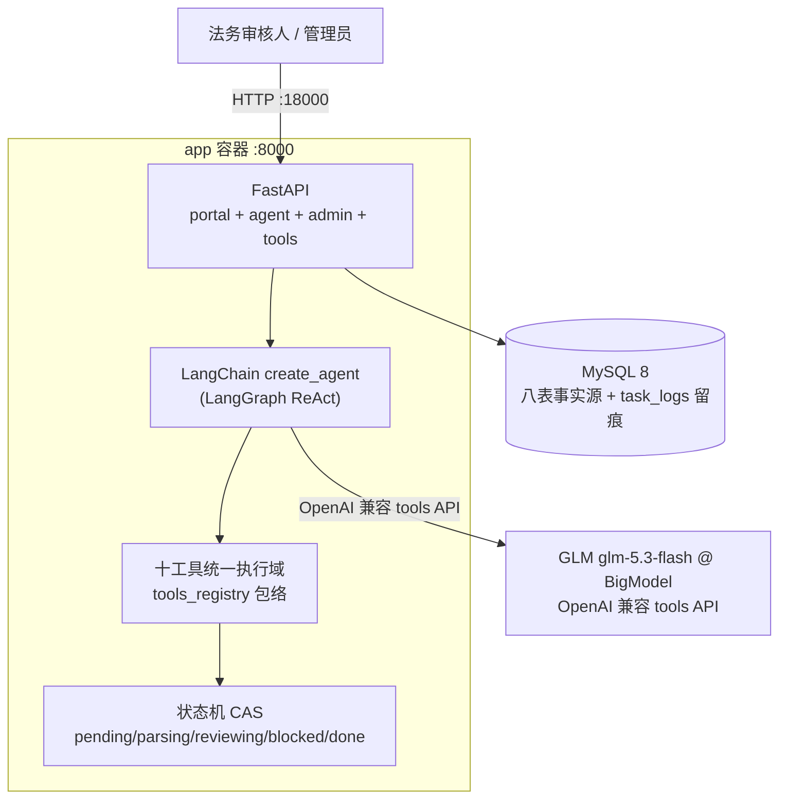

# 软件架构文档（SAD）— 合同审批审查 Agent

| 项 | 内容 |
|----|------|
| 版本 | v2.0（LangChain ReAct · 零降级） |
| 上游 | docs/srd/SRD.md |

> v2.0 变更：引擎层由自研 RunController 迁移至 LangChain 官方 Agent（LangGraph）；
> 废除降级哲学（ADR-B5/B7 废止、B8 收敛为 legacy 车道）；新增 ADR-C1~C5。

## 1. 总体架构（双容器 + 外部 GPU）

**信任边界**：管理面 Admin Token；Agent 对外仅访问 BigModel HTTPS 端点（APIKey 走环境变量，不进代码）；审批域为本系统自有业务表（V1 起 mock 物理删除）。

## 2. 架构决策记录（ADR）

### ADR-B1 ~~模拟审批系统独立成容器~~ → 已废止 v1.0
外部审批域收敛为本系统自有业务表（approval_tasks/approval_attachments/comment_logs），
approval_store 网关保持原签名——「回写=真实业务写入」的语义由本地域等价承载。

### ADR-B2 OCR 选型 tesseract(chi_sim) — 保留
### ADR-B3 规则引擎三模式 — 保留（降格为 AI 的参考线索工具）

### ADR-B4 ~~步数上限+强制兜底回写~~ → 被 ADR-C3 取代
兜底=模板伪造意见，违背「意见完全来自 AI」。V2：递归耗尽可能纠偏一轮，仍失败即 blocked。

### ADR-B5 ~~LLM 降级策略~~ → **已废除 v2.0**
零降级产品铁律：LLM 失败=异常上抛→任务 blocked（人话原因）。GPU 是可用性依赖， outage 即如实停机。

### ADR-B6 认证模型 — 保留（Admin Token 常量时间比较）

### ADR-B7 ~~双通道 Function-Calling~~ → 已废止 v2.0
LangChain create_agent 仅走 OpenAI 兼容原生 tools；JSON 协议降级通道移除。

### ADR-B8 RunController（事件溯源/三维预算/断点恢复/熔断）→ legacy 车道专属
代码保留于 agent_loop.py 供 `AGENT_ENGINE=legacy` 对比；LC 主车道以**闭环闸门+纠偏轮+同单互斥**承接其稳定性诉求。

### ADR-B9 轨迹录制回放 → legacy 专属（录制通道保留，V2 真机用例以 LC_LIVE 门控替代 CI 回放）

### ADR-B10 AI 自由裁量审查层 — 保留（失败留痕不阻断，但不再宣称「静默」为优点）

### ADR-C1 零降级（v2.0 核心铁律）
LLM 不可用/闭环未完成 → 异常上抛 → 502 → 任务 blocked（人话原因+轨迹尾巴）。
动机：v1 的降级让真假运行不可分辨，用户信任崩塌；宁可明着失败。

### ADR-C2 LangChain 官方 Agent 选型
市场成熟方案 `langchain.agents.create_agent`（LangGraph 引擎）；自研调度循环退役。
模型无关：换 OpenAI 兼容模型仅需改 `.env` 的 `LLM_BASE_URL/LLM_API_KEY/LLM_MODEL`。
（本分支实证切换：qwen3-8B@vLLM → glm-5.3-flash@BigModel，代码零改动，仅配置与提示词微调。）

### ADR-C3 闭环闸门与纠偏轮
图跑完≠闭环。未写回即 RuntimeError（附轨迹尾巴）；已保存未写回 → 追加一轮显式纠偏
（模型决策，轨迹记账）；递归耗尽可能纠偏一次；再失败照常掀桌。

### ADR-C4 Schema 诚实与同单互斥
工具 args_schema 从 TOOLS_SCHEMA 动态生成强类型（只声明 dispatch 真实消费参数）；
`engine.try_acquire` 同单互斥，并发双跑 409。

### ADR-C5 批量账本与诚实计时
batch_id 账本（done/skipped）替代「活动状态启发式」；响应携带 elapsed_ms 前端直显——
用户可将对账单元 dmon，GPU 时间全部可归属。

## 3. 存储职责隔离

| 介质 | 职责 | 禁止 |
|------|------|------|
| MySQL | 八表事实源 + task_logs 工具留痕 | 不存文件本体 |
| 本地盘 attachments/ | 附件文件 | — |
| （legacy）agent_runs | RunController 运行记录 | LC 车道不写 |

## 4. 部署视图

- 本地/生产同构：双容器（mysql + app :18000 唯一入口），`TZ=Asia/Shanghai`。
- LLM：智谱 BigModel OpenAI 兼容端点（GLM）→ `LLM_BASE_URL/LLM_API_KEY/LLM_MODEL`；
  **LLM 不可达=审查任务 blocked（零降级）**。本地 GPU vLLM 备选路径见
  deploy/GPU_VLLM_START.md（必须 `--enable-auto-tool-choice --tool-call-parser hermes`）。
- 操作规程见 docs/部署手册.md。
