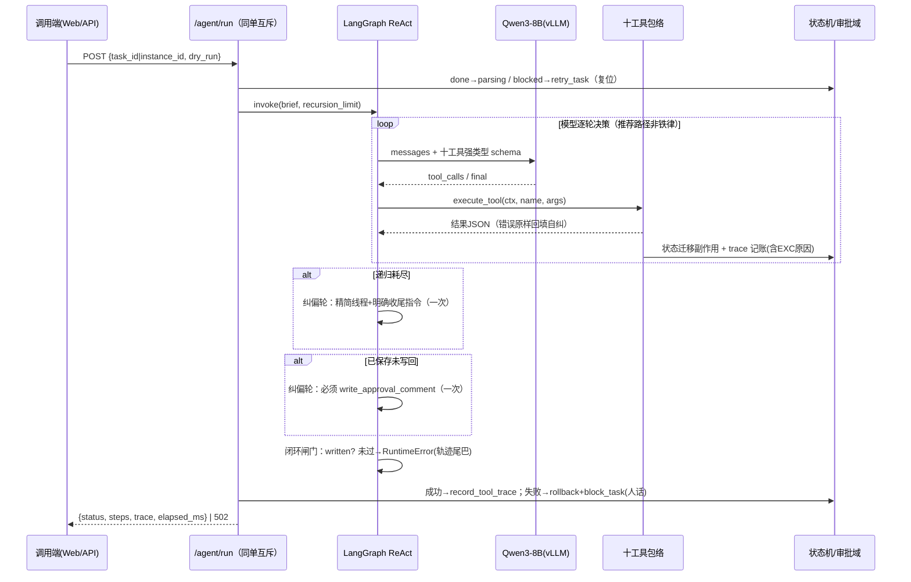

# 软件详细设计文档（SDD）— 合同审批审查 Agent

| 项 | 内容 |
|----|------|
| 版本 | v2.0（LangChain ReAct · 零降级） |
| 上游 | docs/srd/SRD.md · docs/sad/SAD.md |

## 1. 服务与模块划分

```
backend/app/
├── main.py                 FastAPI 装配 + /health + /metrics + 静态托管(web/dist)
├── api/
│   ├── portal.py           /app/forms·queue·batch_review·batch/{id}·files·diag_llm
│   ├── agent.py            /agent/run·tasks·tasks/{id}/retry·tasks/{id}/logs
│   └── admin.py            规则/日志/重置演示（X-Admin-Token）
├── services/
│   ├── engine.py           车道选择器(langchain|legacy) + 同单互斥 try_acquire
│   ├── lc_agent.py         LangChain create_agent 引擎（十工具绑定/闭环闸门/纠偏轮）
│   ├── tools_registry.py   TOOLS_SCHEMA 单一事实源 + execute_tool 统一包络
│   ├── approval_store.py   本地审批域网关（建单/详情/回写/重置演示）
│   ├── fetcher.py          拉取+去重 upsert
│   ├── parser.py           四格式解析+OCR+结构化初稿
│   ├── rule_engine.py      三模式匹配引擎
│   ├── reviewer.py         风险汇总+结果保存+评论写回(幂等守卫)
│   ├── ai_reviewer.py      AI 裁量增量层（ADR-B10）
│   ├── state_machine.py    CAS 迁移 + blocked/retry + 启动自愈
│   ├── run_trace.py        工具轨迹落库 task_logs(type=tool)
│   ├── llm_client.py       httpx vLLM 访问（AI 审查层用）
│   ├── agent_loop.py       （legacy 车道）RunController，非交付面
│   └── tool_errors.py      ToolError 错误分类学
├── core/{config,obs}.py    环境变量集中配置 · JSON日志+Prometheus
├── acceptance/probe.py     V2 探针（11 项，真实栈取证）
├── models/                 八表规范 ORM（+agent_runs legacy 保留）
└── tests/                  88 用例（LC_LIVE=1 门控真机用例）

web/                        Vue3 + Vite（Portal/Detail/Admin），构建产物由 app 同源托管
deploy/                     docker-compose(TZ=Asia/Shanghai) · GPU_VLLM_START.md · mysql/init DDL
```

## 2. Agent 闭环时序（V2 主链路）



## 3. 十工具 Schema（TOOLS_SCHEMA 单一事实源 → 动态强类型 args_schema）

| 工具 | 参数 | 返回要点 |
|------|------|---------|
| list_pending_contract_approvals | limit? | 待审列表 |
| get_contract_approval | —（ctx 驱动） | 审批信息/表单/附件[]/状态 |
| download_contract_attachment | —（ctx 驱动） | 附件落盘清单 |
| parse_contract_document | —（ctx 驱动） | basic_info{} + clauses{} |
| submit_basic_info | fields{字段→值} | 修正解析初稿 status=ai_verified |
| search_contract_text | keyword | 原文片段+位置（≤8 条） |
| list_review_rules | keyword? | 规则库清单（参考线索） |
| run_contract_rules | —（ctx 驱动） | 初筛命中/等级/关注点 |
| save_review_result | overall_risk_level(枚举归一), comment_text 必填, summary_text?, focus_points_json? | review_id |
| write_approval_comment | review_id?（缺省用 ctx） | write_status / deduped |

> 偏差登记：规范 §2.4.10 的 `instance_id/document_id/case_id` 形参已移除——
> dispatch 经 RunContext 取上下文，schema 只声明真实消费参数。

## 4. 规则库种子（11 类）— 与 v1.x 一致，保留

PAY_ADVANCE_HIGH / PAY_CYCLE_LONG / AUTO_RENEW / NO_BREACH / JURISDICTION_RISK /
PARTY_MISSING / AMOUNT_MISSING / NDA_MISSING / DATA_COMPLIANCE / IP_MISSING / ACCEPTANCE_MISSING。
absence 语义与汇总规则（overall=max 命中级）不变；V2 中该结果为**参考线索**，
模型可经 list_review_rules 自主查阅并须回到原文独立判断。

## 4.1 API 清单（当前全集）

| 面 | 路由 |
|----|------|
| 业务面 | POST /app/forms · GET /app/queue · POST /app/batch_review · **GET /app/batch/{batch_id}** · GET /app/files/{tid}/{aid} · GET /app/diag_llm |
| Agent 面 | POST /agent/run · GET /agent/tasks · GET /agent/tasks/{id} · **POST /agent/tasks/{id}/retry（复位+真跑引擎）** · GET /agent/tasks/{id}/logs |
| 管理面 | /admin/rules 增删改 · POST /admin/reset-demo（X-Admin-Token，会清业务数据） |
| 运维面 | GET /metrics · GET /health（mysql/forms/llm） |
| 工具面 | POST /tools/*（Agent 与验收探针共用的直调执行器） |

## 5. 错误处理矩阵（V2）

| 环节 | 异常 | 行为 |
|------|------|------|
| 任意工具 | ToolError | 错误 JSON 回填模型自纠；trace 记 error_code |
| 任意工具 | 未预期异常 | trace 记 `EXC:<原因前120字>`（不匿名）；错误回填模型 |
| LLM 调用 | 超时/连接/401 | 异常上抛 → 502 → rollback+block_task（人话原因） |
| 递归上限 | GraphRecursionError | 纠偏轮一次（精简线程）；仍失败→502+轨迹尾巴 |
| 闭环闸门 | 未写回/未保存 | RuntimeError（附轨迹尾部）→ 502 → blocked |
| 回写 | 5xx/异常 | write_status=failed + blocked 可重试；幂等守卫短路时仍闭环状态到 done |
| 会话损坏 | InvalidRequestError | 失败路径先 rollback 再 block_task（500→502 修复） |

## 6. 配置项

deploy/.env：MYSQL_URL / LLM_BASE_URL / LLM_API_KEY / LLM_MODEL / LLM_TIMEOUT_S /
ADMIN_TOKEN / UPLOAD_DIR / AGENT_MAX_STEPS；compose 注入 TZ=Asia/Shanghai。

## 7. Agent Harness 规格 — LangChain ReAct 引擎（lc_agent.py）

### 7.1 运行模型

```
POST /agent/run（或 retry/batch）
  └─ try_acquire(task) 互斥；复位语义（done/blocked→parsing）
      └─ create_agent(ChatOpenAI, 十工具, system_prompt=方法论+自主决策+规则定位+模型自觉)
          └─ invoke(brief, recursion_limit=agent_max_steps×2)
              ├─ GraphRecursionError → 纠偏轮（精简线程，recursion_limit=agent_max_steps）
              ├─ 已保存未写回 → 纠偏轮（必须 write_approval_comment）
              └─ 闭环闸门：dry_run?review_id:written —— 未过 RuntimeError(轨迹尾巴)
  └─ 成功：record_tool_trace(task_logs) + 返回 {status,steps,raw_output,trace,elapsed_ms}
     失败：rollback → block_task(LLM_RUN_FAILED) → 502
```

### 7.2 系统提示词结构（模块化 skill）

方法论推荐路径（六步）｜自主决策授权（工具/顺序/参数由模型逐轮判断）｜
规则库定位（参考线索非结论）｜意见要求（亲笔+原文佐证+首行总风险等级）｜
模型自觉（8B 局限：优先检索、不确定如实说明、禁止编造条款）。

### 7.3 并发与幂等

- 同单互斥：`engine.try_acquire`（线程锁 + 内存集合），409 拒绝第二请求；批量遇忙跳过并计数。
- 写回幂等：write_status=success 短路外呼，**但仍闭环任务状态到 done**（141 鬼影修复）。

### 7.4 状态机增量

`done→parsing`（再次审查）；`blocked→parsing`（retry_task）；
启动/批量自愈：孤儿→blocked，原因「上次运行未完成……」只陈述事实。

## 8. 解析字段归一化 — 与 v1.x 一致，保留

金额归一化数值元+raw_text；日期 YYYY-MM-DD 锚定；八类条款 present/absent 全入库；
`{value,pos,status}` 三元组契约不变；AI 经 submit_basic_info 修正后 status=ai_verified。
