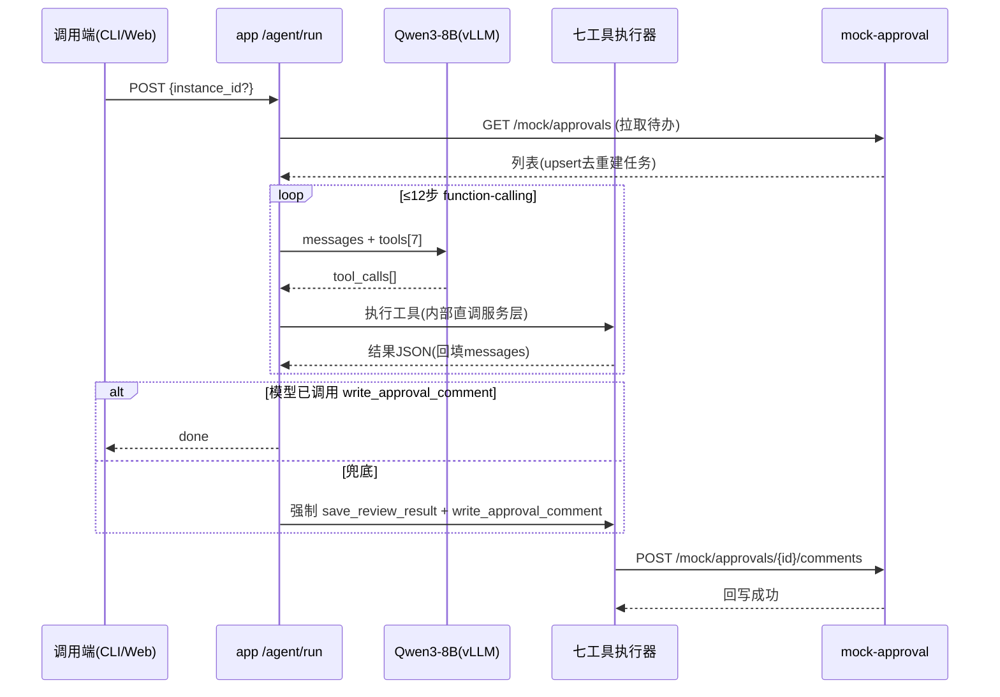

# 软件详细设计文档（SDD）— 合同审批审查 Agent

| 项 | 内容 |
|----|------|
| 版本 | v1.1（对齐复核修订） |
| 上游 | docs/srd/SRD.md · docs/sad/SAD.md |

> v1.1 变更：模块树对齐项目 A 工程结构（api/schemas/tools/tests 分层）；勘误合同画像数量；新增 §7 Agent 循环双通道设计、§8 解析字段归一化规则。

## 1. 服务与模块划分（对齐 kb-platform 分层风格）

```
mock-approval/                 backend/app/
├── main.py                    ├── main.py            FastAPI 装配 + StaticFiles 挂载
├── store.py  内存注册表        ├── api/
├── contracts_def.py           │   ├── tools.py       七工具路由
│   (6份审批单画像:             │   ├── agent.py       run/retry/tasks/logs
│    高/中/低风险docx×3、       │   ├── admin.py       规则/日志/重试(Admin Token)
│    md数据协议×1、             │   └── mock_proxy.py  外部系统仿真路由挂载
│    PNG扫描件×1、              ├── schemas/           Pydantic 请求/响应模型
│    缺附件单×1)                ├── services/
└── Dockerfile                 │   ├── fetcher.py     拉取+去重 upsert
                               │   ├── downloader.py  附件下载落盘
                               │   ├── parser.py      四格式解析+OCR+结构化
                               │   ├── rule_engine.py 三模式匹配引擎
                               │   ├── reviewer.py    风险汇总+评论生成(LLM/模板)
                               │   ├── llm_client.py  vLLM 访问+能力探测(ADR-B7)
                               │   └── agent_loop.py  RunController 主循环(§7)
                               ├── tools/
                               │   ├── bootstrap.py   规则11条种子+mock注册
                               │   ├── record_replay.py LLM轨迹录制/回放(ADR-B9)
                               │   └── demo.py        闭环演示 CLI
                               ├── core/
                               │   ├── config.py      环境变量集中配置
                               │   └── obs.py         JSON日志+Prometheus指标+熔断器
                               ├── prompts/prompts.yaml 提示词版本注册表(G5)
                               ├── models/            八表规范 + agent_runs 工程超集
                               └── tests/             pytest(SQLite 内存库+轨迹回放)

backend/tests/                 deploy/
├── test_rule_engine_matrix.py ├── mysql/init/01_schema.sql   八表 DDL
├── test_fetcher_dedup.py      ├── acceptance/probe.py       AC-1~7 探针
├── test_parser_extract.py     └── docker-compose.prod.yml   云端 override
├── test_state_machine.py
├── test_agent_loop_mock.py
└── test_schema_alignment.py   web/  Vue3 构建产物由 app StaticFiles 同源托管
```

## 2. Agent 闭环时序图（主链路）



**blocked 分支**：附件下载失败/解析空/OCR失败 → task=blocked(+reason) → 循环终止 → POST /tasks/{id}/retry 可回 parsing。

## 3. 七工具 Schema（暴露给模型的 JSON 定义，签名对齐规范 §2.4.10）

| 工具 | 参数 | 返回要点 |
|------|------|---------|
| list_pending_contract_approvals | limit | [{approval_code,title,applicant,apply_time,attachment_count}] |
| get_contract_approval | instance_id | {审批信息,表单数据,附件[],状态} |
| download_contract_attachment | instance_id, attachment_id, file_name | {local_path, sha256} |
| parse_contract_document | document_id(=task_id) | {basic_info{}, clauses{}, parse_status} |
| run_contract_rules | case_id(=task_id) | {hits[], overall_risk_level, focus_points[]} |
| save_review_result | case_id, overall_risk_level, summary_text, focus_points_json, comment_text | {result_id} |
| write_approval_comment | instance_id, review_id | {write_status:"success", comment_id} |

## 4. 规则库种子（11 类，规范 §2.4.6）

| rule_code | 名称 | 级别 | mode | 匹配逻辑 |
|-----------|------|------|------|---------|
| PAY_ADVANCE_HIGH | 预付款比例过高 | high | regex | `预付[^。]{0,10}?([0-9]+)%` capture≥30 命中 |
| PAY_CYCLE_LONG | 付款周期过长 | medium | regex | `(?:验收合格后|交付后)\s*([0-9]+)\s*(?:个)?工作日(?:内)?支付` ≥60 |
| AUTO_RENEW | 自动续约条款 | medium | keyword | 自动续约,自动延长,期满自动 |
| NO_BREACH | 违约责任缺失 | high | absence | 违约,赔偿,责任 |
| JURISDICTION_RISK | 管辖地不利 | medium | regex | `管辖.*?(原告|被告|我方|对方|供方).*?所在地` |
| PARTY_MISSING | 主体信息缺失 | high | absence | 统一社会信用代码,营业执照 |
| AMOUNT_MISSING | 合同金额缺失 | high | absence | 合同金额,总价,合同总价款 |
| NDA_MISSING | 保密条款缺失 | medium | absence | 保密,机密 |
| DATA_COMPLIANCE | 数据处理合规提示 | low | keyword | 个人信息,数据安全,数据保护 |
| IP_MISSING | 知识产权归属缺失 | medium | absence | 知识产权,著作权,成果归属 |
| ACCEPTANCE_MISSING | 验收标准缺失 | high | absence | 验收,检验标准 |

absence 语义：match_text 逗号分隔关键词组，**全部**未出现即命中（缺失即风险）。
汇总规则：overall = max(命中级别)；无命中 → low；关注点 = 各命中 suggestion_text。

## 4.1 API 清单（全集）

| 面 | 路由 | 说明 |
|----|------|------|
| 工具面 | POST /tools/list_pending · /tools/get_approval · /tools/download_attachment · /tools/parse_document · /tools/run_rules · /tools/save_result · /tools/write_comment | 七工具（Agent 与 CLI 共用执行器） |
| Agent 面 | POST /agent/run?dry_run=&background= · GET /agent/tasks · GET /agent/tasks/{id} · POST /agent/tasks/{id}/retry · GET /agent/tasks/{id}/logs · **GET /agent/runs/{run_id}** · **POST /agent/runs/{run_id}/resume** | 触发闭环（dry-run/后台模式）/查询/重试/日志/**运行详情与断点恢复(G1)** |
| Mock 面(内网) | GET /mock/approvals · GET /mock/approvals/{iid} · GET /mock/approvals/{iid}/attachments/{aid} · POST /mock/approvals/{iid}/comments · POST /mock/reset | 外部审批系统仿真 |
| 管理面 | GET/PUT /admin/rules · GET /admin/logs/{task_id} · POST /admin/reset-demo（X-Admin-Token） | 系统管理员 |
| 运维面 | **GET /metrics**（Prometheus 文本）· **GET /health**（组件级 mysql/mock/llm 探测） | 指标暴露与健康探测(N04/G4) |

## 5. 错误处理矩阵（blocked 触发面）

| 环节 | 异常 | 行为 |
|------|------|------|
| 下载 | 文件不存在/mock 不可达 | blocked(block_reason) 可重试 |
| 解析 | PDF 无文字层且非扫描路径 | 尝试 OCR → 仍失败 blocked |
| OCR | 图片空白/识别率低 | blocked（演示阻塞用例） |
| 规则 | 正则编译异常 | 该规则 error 跳过，不阻断整体 |
| 回写 | mock 评论接口 5xx | write_status=failed + blocked 可重试 |

## 6. 配置项

见 deploy/.env.example（MYSQL_URL / LLM_* / ADMIN_TOKEN / UPLOAD_DIR / TESSERACT_CMD / OCR_LANG / AGENT_MAX_STEPS）。

## 7. Agent Harness 规格 — RunController（ADR-B7/B8/B9 落地，v1.2）

### 7.1 运行模型与生命周期

```
POST /agent/run
  └─> 创建 agent_runs 行(status=running, channel=pending, prompt_version)
       └─> RunController.run(run_id)
            ├─ CAS 守卫: 同一 task 已有 running 运行 → 409 拒绝并发
            ├─ 能力探测(进程级缓存): native | json | circuit_open→deterministic
            ├─ 循环: LLM 调度工具执行器（两通道同执行器）
            │    每步: messages 快照 UPSERT 到 agent_runs.messages_json   ← 断点恢复点(G1)
            │          steps_used/tokens/wall 累加, 任一预算触顶 → finalize()
            ├─ finalize(): 强制 save_review_result + write_approval_comment(带护栏G7)
            └─ 终态: succeeded | blocked(reason) | failed
                 agent_runs 落 finished_at/error_digest; task_logs 全程事件
```

**CAS 并发守卫**：任务状态迁移一律 `UPDATE ... WHERE id=? AND task_status IN (合法前驱集合)`，受影响行数=0 即视为竞争失败重读——不依赖分布式锁。

### 7.2 agent_runs 表（第九表·偏差登记）

```sql
CREATE TABLE IF NOT EXISTS agent_runs (
    id             BIGINT AUTO_INCREMENT PRIMARY KEY,
    task_id        BIGINT NOT NULL,
    channel        VARCHAR(16) NOT NULL DEFAULT 'pending' COMMENT 'native|json|deterministic|pending',
    status         VARCHAR(16) NOT NULL DEFAULT 'running' COMMENT 'running|succeeded|blocked|failed',
    dry_run        TINYINT NOT NULL DEFAULT 0,
    steps_used     INT NOT NULL DEFAULT 0,
    prompt_tokens  INT NOT NULL DEFAULT 0,
    completion_tokens INT NOT NULL DEFAULT 0,
    llm_calls      INT NOT NULL DEFAULT 0,
    wall_ms        INT NOT NULL DEFAULT 0,
    fallback_kind  VARCHAR(32) NULL COMMENT 'budget_steps|budget_tokens|budget_wall|circuit_open|llm_down|model_no_write',
    prompt_version VARCHAR(32) NOT NULL DEFAULT '',
    model_name     VARCHAR(64) NOT NULL DEFAULT '',
    messages_json  JSON NULL COMMENT '最近消息快照(resume 源)',
    error_digest   VARCHAR(512) NULL,
    created_at     DATETIME NOT NULL DEFAULT CURRENT_TIMESTAMP,
    updated_at     DATETIME NOT NULL DEFAULT CURRENT_TIMESTAMP ON UPDATE CURRENT_TIMESTAMP,
    finished_at    DATETIME NULL,
    KEY idx_runs_task (task_id), KEY idx_runs_status (status)
) ENGINE=InnoDB DEFAULT CHARSET=utf8mb4;
```

### 7.3 双通道调度与熔断

- **能力探测**：`llm_client.probe()` 首次运行时发 1-token 最小 tools 请求——返回结构化 tool_calls → 锁定 native；否则 json。结果进程内缓存。
- **JSON 协议约定**：system 注入七工具签名；模型每轮仅输出一行 `{"tool":"...","args":{...}}` 或 `{"final":"..."}`；解析取首个平衡 `{...}` 块 + `json.loads` 宽松容错。
- **熔断器**（core/obs.py）：连续失败 ≥`CIRCUIT_FAIL_THRESHOLD=3` → open `CIRCUIT_OPEN_SECONDS=60`；open 期调用直接走 deterministic 并记 fallback_kind=circuit_open；半开期放行一次探测成功即 closed。

### 7.4 三维预算与优雅终结

| 维度 | 默认 | 触顶行为 |
|------|------|---------|
| 步数 | `AGENT_MAX_STEPS=12`（规范字面） | finalize() |
| token | `AGENT_TOKEN_BUDGET=24000`（prompt+completion 累计） | finalize() |
| 墙钟 | `AGENT_WALL_BUDGET_S=180`（每步边界检查） | finalize() |

finalize() = 以已采集 parse/rule 数据走模板意见 → save_review_result → write_approval_comment(护栏) → 成功则 succeeded(fallback_kind 记原因)；评论外呼失败 → blocked(write_failed) 可重试。

### 7.5 错误分类学（error_code → retriable → 处理）

| error_code | retriable | 处理 |
|-----------|-----------|------|
| MOCK_UNREACHABLE | 是 | 工具结果回填错误文本让模型自纠；连续触发熔断逻辑 |
| ATTACHMENT_MISSING / PARSE_EMPTY / OCR_FAILED | 否 | task=blocked(block_stage) 可人工 retry |
| LLM_TIMEOUT / LLM_UNAVAILABLE | 是 | 回退确定性路径；计入熔断计数 |
| VALIDATION_ERROR(工具参数) | 是 | 校验错误回填模型自纠一次，再犯走兜底 |
| WRITE_GUARD_REJECTED | 否 | 幂等守卫命中，直接返回既有结果 |

HTTP 层：GET 类（拉取/下载/健康）httpx transport `retries=2, backoff_factor=0.5`；POST 评论**不自动重试**（非幂等），仅显式 retry 动作可重发。

### 7.6 工具执行包络

每个工具 = Pydantic args schema + 执行函数 + result schema；统一包络 `{ok, data|error{code,message,retriable}, ms}`。超时表：download 30s / parse(含OCR) 90s / rules 10s / llm 单轮 120s / mock HTTP 15s。超时按 retriable=是处理并计入熔断。

### 7.7 可观测（N04/G4）

- **JSON 日志**：stdout 每行 `{ts, level, event, run_id, task_id, tool?, ms?, err?}`；业务可见子集同步落 task_logs。
- **/metrics**（prometheus_client）：`cra_runs_total{channel,status}`、`cra_llm_calls_total{channel}`、`cra_tool_calls_total{tool,outcome}`、`cra_fallback_total{kind}`、`cra_blocked_total{reason}`、`cra_run_latency_seconds`(Histogram)、`cra_circuit_state`(Gauge 0/1/2)。
- **/health**：`{status, components:{mysql:{ok,latency_ms}, mock:{ok}, llm:{ok,cached_probe}}}`，任一组件失败 status=degraded 但仍 200（编排层自判）。

### 7.8 安全护栏（G7）

dry_run=true：全程真实执行，write_comment 执行器入口处拦截改记日志，agent_runs.dry_run=1。
回写净化：comment_text ≤4000 字符（截断加省略标记）；必须含「总风险等级」行否则拒绝回写；控制符/零宽字符清洗。
幂等守卫：task.write_status=success 时 write 工具直接返回既有 comment 引用，除非 force=true（Admin）。

### 7.9 提示词版本注册表（G5）

`backend/app/prompts/prompts.yaml`：每条 prompt 含 `id/version/template`；RunController 启动时解析当前激活版本，写入 agent_runs.prompt_version。改提示词不改代码——升 version 即可追溯任意历史运行用的是哪版提示词。

### 7.10 轨迹录制回放（G6/ADR-B9）

录制：`RECORD_TRAJECTORY=<case名>` 时，LLMTransport 将逐轮请求摘要+响应原样追加写 `tests/fixtures/trajectories/<case>.jsonl`。
回放：测试装配 FakeTransport 按 fixtures 顺序吐响应；断言点含工具调用序列、终态、fallback_kind。GPU 录一次，CI 永久回归。

## 8. 解析字段归一化规则

- **金额 amount**：正则捕获后归一化为数值元 `amount_value:number`（"50万元"→500000.00；含千分位/小数处理），同时保留 `raw_text:"50万元"` 与 pos/status——规则引擎（预付款比例、金额缺失）一律消费归一化值。
- **日期 effective_date/expire_date**：统一为 `YYYY-MM-DD` 字符串；正则收紧年份锚定（`(19|20)\d{2}年`），消除"自营"类误匹配。
- **条款定位**：八类条款均输出 `{status: present|absent, snippet?, pos?}`；absent 也入库（规范要求"不允许只返回空结果"）。
- 所有提取字段三元组 `{value, pos, status}` 为 SDD 契约，LLM 增强提取的结果必须映射回同一契约再叠加（LLM 只补字段值，不改结构）。
