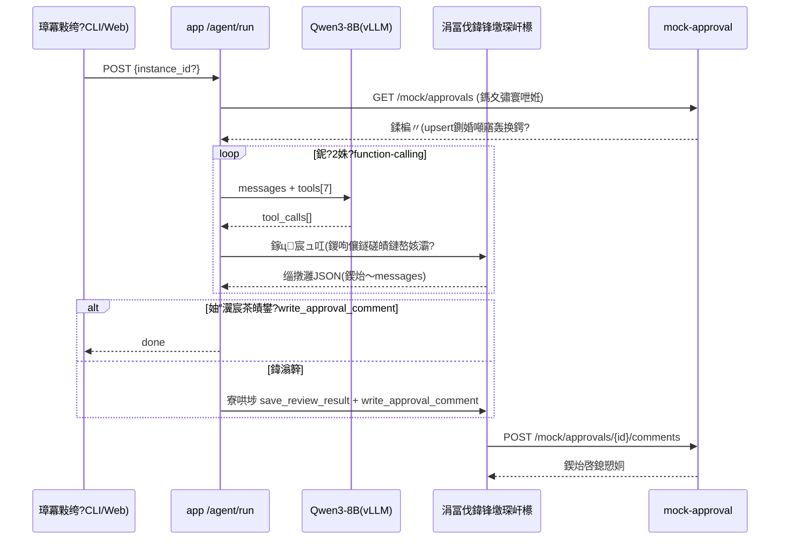

> [!NOTE]
> 本文描述 **main v1.x 基线**。分支 \eat/langchain-react-gpu-only\（V2：LangChain ReAct、十工具、零降级、重试即真跑引擎等）的行为差异以 [V2分支现状.md](V2分支现状.md) 为准，冲突处以该文档为准。
# 杞欢璇︾粏璁捐鏂囨。锛圫DD锛夆€?鍚堝悓瀹℃壒瀹℃煡 Agent

| 椤?| 鍐呭 |
|----|------|
| 鐗堟湰 | v1.1锛堝榻愬鏍镐慨璁級 |
| 涓婃父 | docs/srd/SRD.md 路 docs/sad/SAD.md |

> v1.1 鍙樻洿锛氭ā鍧楁爲瀵归綈椤圭洰 A 宸ョ▼缁撴瀯锛坅pi/schemas/tools/tests 鍒嗗眰锛夛紱鍕樿鍚堝悓鐢诲儚鏁伴噺锛涙柊澧?搂7 Agent 寰幆鍙岄€氶亾璁捐銆伮? 瑙ｆ瀽瀛楁褰掍竴鍖栬鍒欍€?
## 1. 鏈嶅姟涓庢ā鍧楀垝鍒嗭紙瀵归綈 kb-platform 鍒嗗眰椋庢牸锛?
```
mock-approval/                 backend/app/
鈹溾攢鈹€ main.py                    鈹溾攢鈹€ main.py            FastAPI 瑁呴厤 + StaticFiles 鎸傝浇
鈹溾攢鈹€ store.py  鍐呭瓨娉ㄥ唽琛?       鈹溾攢鈹€ api/
鈹溾攢鈹€ contracts_def.py           鈹?  鈹溾攢鈹€ tools.py       涓冨伐鍏疯矾鐢?鈹?  (6浠藉鎵瑰崟鐢诲儚:             鈹?  鈹溾攢鈹€ agent.py       run/retry/tasks/logs
鈹?   楂?涓?浣庨闄ヾocx脳3銆?      鈹?  鈹溾攢鈹€ admin.py       瑙勫垯/鏃ュ織/閲嶈瘯(Admin Token)
鈹?   md鏁版嵁鍗忚脳1銆?            鈹?  鈹斺攢鈹€ mock_proxy.py  澶栭儴绯荤粺浠跨湡璺敱鎸傝浇
鈹?   PNG鎵弿浠睹?銆?             鈹溾攢鈹€ schemas/           Pydantic 璇锋眰/鍝嶅簲妯″瀷
鈹?   缂洪檮浠跺崟脳1)                鈹溾攢鈹€ services/
鈹斺攢鈹€ Dockerfile                 鈹?  鈹溾攢鈹€ fetcher.py     鎷夊彇+鍘婚噸 upsert
                               鈹?  鈹溾攢鈹€ downloader.py  闄勪欢涓嬭浇钀界洏
                               鈹?  鈹溾攢鈹€ parser.py      鍥涙牸寮忚В鏋?OCR+缁撴瀯鍖?                               鈹?  鈹溾攢鈹€ rule_engine.py 涓夋ā寮忓尮閰嶅紩鎿?                               鈹?  鈹溾攢鈹€ reviewer.py    椋庨櫓姹囨€?璇勮鐢熸垚(LLM/妯℃澘)
                               鈹?  鈹溾攢鈹€ llm_client.py  vLLM 璁块棶+鑳藉姏鎺㈡祴(ADR-B7)
                               鈹?  鈹斺攢鈹€ agent_loop.py  RunController 涓诲惊鐜?搂7)
                               鈹溾攢鈹€ tools/
                               鈹?  鈹溾攢鈹€ bootstrap.py   瑙勫垯11鏉＄瀛?mock娉ㄥ唽
                               鈹?  鈹溾攢鈹€ record_replay.py LLM杞ㄨ抗褰曞埗/鍥炴斁(ADR-B9)
                               鈹?  鈹斺攢鈹€ demo.py        闂幆婕旂ず CLI
                               鈹溾攢鈹€ core/
                               鈹?  鈹溾攢鈹€ config.py      鐜鍙橀噺闆嗕腑閰嶇疆
                               鈹?  鈹斺攢鈹€ obs.py         JSON鏃ュ織+Prometheus鎸囨爣+鐔旀柇鍣?                               鈹溾攢鈹€ prompts/prompts.yaml 鎻愮ず璇嶇増鏈敞鍐岃〃(G5)
                               鈹溾攢鈹€ models/            鍏〃瑙勮寖 + agent_runs 宸ョ▼瓒呴泦
                               鈹斺攢鈹€ tests/             pytest(SQLite 鍐呭瓨搴?杞ㄨ抗鍥炴斁)

backend/tests/                 deploy/
鈹溾攢鈹€ test_rule_engine_matrix.py 鈹溾攢鈹€ mysql/init/01_schema.sql   鍏〃 DDL
鈹溾攢鈹€ test_fetcher_dedup.py      鈹溾攢鈹€ acceptance/probe.py       AC-1~7 鎺㈤拡
鈹溾攢鈹€ test_parser_extract.py     鈹斺攢鈹€ docker-compose.prod.yml   浜戠 override
鈹溾攢鈹€ test_state_machine.py
鈹溾攢鈹€ test_agent_loop_mock.py
鈹斺攢鈹€ test_schema_alignment.py   web/  Vue3 鏋勫缓浜х墿鐢?app StaticFiles 鍚屾簮鎵樼
```

## 2. Agent 闂幆鏃跺簭鍥撅紙涓婚摼璺級



**blocked 鍒嗘敮**锛氶檮浠朵笅杞藉け璐?瑙ｆ瀽绌?OCR澶辫触 鈫?task=blocked(+reason) 鈫?寰幆缁堟 鈫?POST /tasks/{id}/retry 鍙洖 parsing銆?
## 3. 涓冨伐鍏?Schema锛堟毚闇茬粰妯″瀷鐨?JSON 瀹氫箟锛岀鍚嶅榻愯鑼?搂2.4.10锛?
| 宸ュ叿 | 鍙傛暟 | 杩斿洖瑕佺偣 |
|------|------|---------|
| list_pending_contract_approvals | limit | [{approval_code,title,applicant,apply_time,attachment_count}] |
| get_contract_approval | instance_id | {瀹℃壒淇℃伅,琛ㄥ崟鏁版嵁,闄勪欢[],鐘舵€亇 |
| download_contract_attachment | instance_id, attachment_id, file_name | {local_path, sha256} |
| parse_contract_document | document_id(=task_id) | {basic_info{}, clauses{}, parse_status} |
| run_contract_rules | case_id(=task_id) | {hits[], overall_risk_level, focus_points[]} |
| save_review_result | case_id, overall_risk_level, summary_text, focus_points_json, comment_text | {result_id} |
| write_approval_comment | instance_id, review_id | {write_status:"success", comment_id} |

## 4. 瑙勫垯搴撶瀛愶紙11 绫伙紝瑙勮寖 搂2.4.6锛?
| rule_code | 鍚嶇О | 绾у埆 | mode | 鍖归厤閫昏緫 |
|-----------|------|------|------|---------|
| PAY_ADVANCE_HIGH | 棰勪粯娆炬瘮渚嬭繃楂?| high | regex | `棰勪粯[^銆俔{0,10}?([0-9]+)%` capture鈮?0 鍛戒腑 |
| PAY_CYCLE_LONG | 浠樻鍛ㄦ湡杩囬暱 | medium | regex | `(?:楠屾敹鍚堟牸鍚巪浜や粯鍚?\s*([0-9]+)\s*(?:涓??宸ヤ綔鏃??:鍐??鏀粯` 鈮?0 |
| AUTO_RENEW | 鑷姩缁害鏉℃ | medium | keyword | 鑷姩缁害,鑷姩寤堕暱,鏈熸弧鑷姩 |
| NO_BREACH | 杩濈害璐ｄ换缂哄け | high | absence | 杩濈害,璧斿伩,璐ｄ换 |
| JURISDICTION_RISK | 绠¤緰鍦颁笉鍒?| medium | regex | `绠¤緰.*?(鍘熷憡|琚憡|鎴戞柟|瀵规柟|渚涙柟).*?鎵€鍦ㄥ湴` |
| PARTY_MISSING | 涓讳綋淇℃伅缂哄け | high | absence | 缁熶竴绀句細淇＄敤浠ｇ爜,钀ヤ笟鎵х収 |
| AMOUNT_MISSING | 鍚堝悓閲戦缂哄け | high | absence | 鍚堝悓閲戦,鎬讳环,鍚堝悓鎬讳环娆?|
| NDA_MISSING | 淇濆瘑鏉℃缂哄け | medium | absence | 淇濆瘑,鏈哄瘑 |
| DATA_COMPLIANCE | 鏁版嵁澶勭悊鍚堣鎻愮ず | low | keyword | 涓汉淇℃伅,鏁版嵁瀹夊叏,鏁版嵁淇濇姢 |
| IP_MISSING | 鐭ヨ瘑浜ф潈褰掑睘缂哄け | medium | absence | 鐭ヨ瘑浜ф潈,钁椾綔鏉?鎴愭灉褰掑睘 |
| ACCEPTANCE_MISSING | 楠屾敹鏍囧噯缂哄け | high | absence | 楠屾敹,妫€楠屾爣鍑?|

absence 璇箟锛歮atch_text 閫楀彿鍒嗛殧鍏抽敭璇嶇粍锛?*鍏ㄩ儴**鏈嚭鐜板嵆鍛戒腑锛堢己澶卞嵆椋庨櫓锛夈€?姹囨€昏鍒欙細overall = max(鍛戒腑绾у埆)锛涙棤鍛戒腑 鈫?low锛涘叧娉ㄧ偣 = 鍚勫懡涓?suggestion_text銆?
## 4.1 API 娓呭崟锛堝叏闆嗭級

| 闈?| 璺敱 | 璇存槑 |
|----|------|------|
| 宸ュ叿闈?| POST /tools/list_pending 路 /tools/get_approval 路 /tools/download_attachment 路 /tools/parse_document 路 /tools/run_rules 路 /tools/save_result 路 /tools/write_comment | 涓冨伐鍏凤紙Agent 涓?CLI 鍏辩敤鎵ц鍣級 |
| Agent 闈?| POST /agent/run?dry_run=&background= 路 GET /agent/tasks 路 GET /agent/tasks/{id} 路 POST /agent/tasks/{id}/retry 路 GET /agent/tasks/{id}/logs 路 **GET /agent/runs/{run_id}** 路 **POST /agent/runs/{run_id}/resume** | 瑙﹀彂闂幆锛坉ry-run/鍚庡彴妯″紡锛?鏌ヨ/閲嶈瘯/鏃ュ織/**杩愯璇︽儏涓庢柇鐐规仮澶?G1)** |
| Mock 闈?鍐呯綉) | GET /mock/approvals 路 GET /mock/approvals/{iid} 路 GET /mock/approvals/{iid}/attachments/{aid} 路 POST /mock/approvals/{iid}/comments 路 POST /mock/reset | 澶栭儴瀹℃壒绯荤粺浠跨湡 |
| 绠＄悊闈?| GET/PUT /admin/rules 路 GET /admin/logs/{task_id} 路 POST /admin/reset-demo锛圶-Admin-Token锛?| 绯荤粺绠＄悊鍛?|
| 杩愮淮闈?| **GET /metrics**锛圥rometheus 鏂囨湰锛壜?**GET /health**锛堢粍浠剁骇 mysql/mock/llm 鎺㈡祴锛?| 鎸囨爣鏆撮湶涓庡仴搴锋帰娴?N04/G4) |

## 5. 閿欒澶勭悊鐭╅樀锛坆locked 瑙﹀彂闈級

| 鐜妭 | 寮傚父 | 琛屼负 |
|------|------|------|
| 涓嬭浇 | 鏂囦欢涓嶅瓨鍦?mock 涓嶅彲杈?| blocked(block_reason) 鍙噸璇?|
| 瑙ｆ瀽 | PDF 鏃犳枃瀛楀眰涓旈潪鎵弿璺緞 | 灏濊瘯 OCR 鈫?浠嶅け璐?blocked |
| OCR | 鍥剧墖绌虹櫧/璇嗗埆鐜囦綆 | blocked锛堟紨绀洪樆濉炵敤渚嬶級 |
| 瑙勫垯 | 姝ｅ垯缂栬瘧寮傚父 | 璇ヨ鍒?error 璺宠繃锛屼笉闃绘柇鏁翠綋 |
| 鍥炲啓 | mock 璇勮鎺ュ彛 5xx | write_status=failed + blocked 鍙噸璇?|

## 6. 閰嶇疆椤?
瑙?deploy/.env.example锛圡YSQL_URL / LLM_* / ADMIN_TOKEN / UPLOAD_DIR / TESSERACT_CMD / OCR_LANG / AGENT_MAX_STEPS锛夈€?
## 7. Agent Harness 瑙勬牸 鈥?RunController锛圓DR-B7/B8/B9 钀藉湴锛寁1.2锛?
### 7.1 杩愯妯″瀷涓庣敓鍛藉懆鏈?
```
POST /agent/run
  鈹斺攢> 鍒涘缓 agent_runs 琛?status=running, channel=pending, prompt_version)
       鈹斺攢> RunController.run(run_id)
            鈹溾攢 CAS 瀹堝崼: 鍚屼竴 task 宸叉湁 running 杩愯 鈫?409 鎷掔粷骞跺彂
            鈹溾攢 鑳藉姏鎺㈡祴(杩涚▼绾х紦瀛?: native | json | circuit_open鈫抎eterministic
            鈹溾攢 寰幆: LLM 璋冨害宸ュ叿鎵ц鍣紙涓ら€氶亾鍚屾墽琛屽櫒锛?            鈹?   姣忔: messages 蹇収 UPSERT 鍒?agent_runs.messages_json   鈫?鏂偣鎭㈠鐐?G1)
            鈹?         steps_used/tokens/wall 绱姞, 浠讳竴棰勭畻瑙﹂《 鈫?finalize()
            鈹溾攢 finalize(): 寮哄埗 save_review_result + write_approval_comment(甯︽姢鏍廏7)
            鈹斺攢 缁堟€? succeeded | blocked(reason) | failed
                 agent_runs 钀?finished_at/error_digest; task_logs 鍏ㄧ▼浜嬩欢
```

**CAS 骞跺彂瀹堝崼**锛氫换鍔＄姸鎬佽縼绉讳竴寰?`UPDATE ... WHERE id=? AND task_status IN (鍚堟硶鍓嶉┍闆嗗悎)`锛屽彈褰卞搷琛屾暟=0 鍗宠涓虹珵浜夊け璐ラ噸璇烩€斺€斾笉渚濊禆鍒嗗竷寮忛攣銆?
### 7.2 agent_runs 琛紙绗節琛峰亸宸櫥璁帮級

```sql
CREATE TABLE IF NOT EXISTS agent_runs (
    id             BIGINT AUTO_INCREMENT PRIMARY KEY,
    task_id        BIGINT NOT NULL,
    channel        VARCHAR(16) NOT NULL DEFAULT 'pending' COMMENT 'native|json|deterministic|pending',
    status         VARCHAR(16) NOT NULL DEFAULT 'running' COMMENT 'running|succeeded|blocked|failed',
    dry_run        TINYINT NOT NULL DEFAULT 0,
    steps_used     INT NOT NULL DEFAULT 0,
    prompt_tokens  INT NOT NULL DEFAULT 0,
    completion_tokens INT NOT NULL DEFAULT 0,
    llm_calls      INT NOT NULL DEFAULT 0,
    wall_ms        INT NOT NULL DEFAULT 0,
    fallback_kind  VARCHAR(32) NULL COMMENT 'budget_steps|budget_tokens|budget_wall|circuit_open|llm_down|model_no_write',
    prompt_version VARCHAR(32) NOT NULL DEFAULT '',
    model_name     VARCHAR(64) NOT NULL DEFAULT '',
    messages_json  JSON NULL COMMENT '鏈€杩戞秷鎭揩鐓?resume 婧?',
    error_digest   VARCHAR(512) NULL,
    created_at     DATETIME NOT NULL DEFAULT CURRENT_TIMESTAMP,
    updated_at     DATETIME NOT NULL DEFAULT CURRENT_TIMESTAMP ON UPDATE CURRENT_TIMESTAMP,
    finished_at    DATETIME NULL,
    KEY idx_runs_task (task_id), KEY idx_runs_status (status)
) ENGINE=InnoDB DEFAULT CHARSET=utf8mb4;
```

### 7.3 鍙岄€氶亾璋冨害涓庣啍鏂?
- **鑳藉姏鎺㈡祴**锛歚llm_client.probe()` 棣栨杩愯鏃跺彂 1-token 鏈€灏?tools 璇锋眰鈥斺€旇繑鍥炵粨鏋勫寲 tool_calls 鈫?閿佸畾 native锛涘惁鍒?json銆傜粨鏋滆繘绋嬪唴缂撳瓨銆?- **JSON 鍗忚绾﹀畾**锛歴ystem 娉ㄥ叆涓冨伐鍏风鍚嶏紱妯″瀷姣忚疆浠呰緭鍑轰竴琛?`{"tool":"...","args":{...}}` 鎴?`{"final":"..."}`锛涜В鏋愬彇棣栦釜骞宠　 `{...}` 鍧?+ `json.loads` 瀹芥澗瀹归敊銆?- **鐔旀柇鍣?*锛坈ore/obs.py锛夛細杩炵画澶辫触 鈮CIRCUIT_FAIL_THRESHOLD=3` 鈫?open `CIRCUIT_OPEN_SECONDS=60`锛沷pen 鏈熻皟鐢ㄧ洿鎺ヨ蛋 deterministic 骞惰 fallback_kind=circuit_open锛涘崐寮€鏈熸斁琛屼竴娆℃帰娴嬫垚鍔熷嵆 closed銆?
### 7.4 涓夌淮棰勭畻涓庝紭闆呯粓缁?
| 缁村害 | 榛樿 | 瑙﹂《琛屼负 |
|------|------|---------|
| 姝ユ暟 | `AGENT_MAX_STEPS=12`锛堣鑼冨瓧闈級 | finalize() |
| token | `AGENT_TOKEN_BUDGET=24000`锛坧rompt+completion 绱锛?| finalize() |
| 澧欓挓 | `AGENT_WALL_BUDGET_S=180`锛堟瘡姝ヨ竟鐣屾鏌ワ級 | finalize() |

finalize() = 浠ュ凡閲囬泦 parse/rule 鏁版嵁璧版ā鏉挎剰瑙?鈫?save_review_result 鈫?write_approval_comment(鎶ゆ爮) 鈫?鎴愬姛鍒?succeeded(fallback_kind 璁板師鍥?锛涜瘎璁哄鍛煎け璐?鈫?blocked(write_failed) 鍙噸璇曘€?
### 7.5 閿欒鍒嗙被瀛︼紙error_code 鈫?retriable 鈫?澶勭悊锛?
| error_code | retriable | 澶勭悊 |
|-----------|-----------|------|
| MOCK_UNREACHABLE | 鏄?| 宸ュ叿缁撴灉鍥炲～閿欒鏂囨湰璁╂ā鍨嬭嚜绾狅紱杩炵画瑙﹀彂鐔旀柇閫昏緫 |
| ATTACHMENT_MISSING / PARSE_EMPTY / OCR_FAILED | 鍚?| task=blocked(block_stage) 鍙汉宸?retry |
| LLM_TIMEOUT / LLM_UNAVAILABLE | 鏄?| 鍥為€€纭畾鎬ц矾寰勶紱璁″叆鐔旀柇璁℃暟 |
| VALIDATION_ERROR(宸ュ叿鍙傛暟) | 鏄?| 鏍￠獙閿欒鍥炲～妯″瀷鑷籂涓€娆★紝鍐嶇姱璧板厹搴?|
| WRITE_GUARD_REJECTED | 鍚?| 骞傜瓑瀹堝崼鍛戒腑锛岀洿鎺ヨ繑鍥炴棦鏈夌粨鏋?|

HTTP 灞傦細GET 绫伙紙鎷夊彇/涓嬭浇/鍋ュ悍锛塰ttpx transport `retries=2, backoff_factor=0.5`锛汸OST 璇勮**涓嶈嚜鍔ㄩ噸璇?*锛堥潪骞傜瓑锛夛紝浠呮樉寮?retry 鍔ㄤ綔鍙噸鍙戙€?
### 7.6 宸ュ叿鎵ц鍖呯粶

姣忎釜宸ュ叿 = Pydantic args schema + 鎵ц鍑芥暟 + result schema锛涚粺涓€鍖呯粶 `{ok, data|error{code,message,retriable}, ms}`銆傝秴鏃惰〃锛歞ownload 30s / parse(鍚玂CR) 90s / rules 10s / llm 鍗曡疆 120s / mock HTTP 15s銆傝秴鏃舵寜 retriable=鏄鐞嗗苟璁″叆鐔旀柇銆?
### 7.7 鍙娴嬶紙N04/G4锛?
- **JSON 鏃ュ織**锛歴tdout 姣忚 `{ts, level, event, run_id, task_id, tool?, ms?, err?}`锛涗笟鍔″彲瑙佸瓙闆嗗悓姝ヨ惤 task_logs銆?- **/metrics**锛坧rometheus_client锛夛細`cra_runs_total{channel,status}`銆乣cra_llm_calls_total{channel}`銆乣cra_tool_calls_total{tool,outcome}`銆乣cra_fallback_total{kind}`銆乣cra_blocked_total{reason}`銆乣cra_run_latency_seconds`(Histogram)銆乣cra_circuit_state`(Gauge 0/1/2)銆?- **/health**锛歚{status, components:{mysql:{ok,latency_ms}, mock:{ok}, llm:{ok,cached_probe}}}`锛屼换涓€缁勪欢澶辫触 status=degraded 浣嗕粛 200锛堢紪鎺掑眰鑷垽锛夈€?
### 7.8 瀹夊叏鎶ゆ爮锛圙7锛?
dry_run=true锛氬叏绋嬬湡瀹炴墽琛岋紝write_comment 鎵ц鍣ㄥ叆鍙ｅ鎷︽埅鏀硅鏃ュ織锛宎gent_runs.dry_run=1銆?鍥炲啓鍑€鍖栵細comment_text 鈮?000 瀛楃锛堟埅鏂姞鐪佺暐鏍囪锛夛紱蹇呴』鍚€屾€婚闄╃瓑绾с€嶈鍚﹀垯鎷掔粷鍥炲啓锛涙帶鍒剁/闆跺瀛楃娓呮礂銆?骞傜瓑瀹堝崼锛歵ask.write_status=success 鏃?write 宸ュ叿鐩存帴杩斿洖鏃㈡湁 comment 寮曠敤锛岄櫎闈?force=true锛圓dmin锛夈€?
### 7.9 鎻愮ず璇嶇増鏈敞鍐岃〃锛圙5锛?
`backend/app/prompts/prompts.yaml`锛氭瘡鏉?prompt 鍚?`id/version/template`锛汻unController 鍚姩鏃惰В鏋愬綋鍓嶆縺娲荤増鏈紝鍐欏叆 agent_runs.prompt_version銆傛敼鎻愮ず璇嶄笉鏀逛唬鐮佲€斺€斿崌 version 鍗冲彲杩芥函浠绘剰鍘嗗彶杩愯鐢ㄧ殑鏄摢鐗堟彁绀鸿瘝銆?
### 7.10 杞ㄨ抗褰曞埗鍥炴斁锛圙6/ADR-B9锛?
褰曞埗锛歚RECORD_TRAJECTORY=<case鍚?` 鏃讹紝LLMTransport 灏嗛€愯疆璇锋眰鎽樿+鍝嶅簲鍘熸牱杩藉姞鍐?`tests/fixtures/trajectories/<case>.jsonl`銆?鍥炴斁锛氭祴璇曡閰?FakeTransport 鎸?fixtures 椤哄簭鍚愬搷搴旓紱鏂█鐐瑰惈宸ュ叿璋冪敤搴忓垪銆佺粓鎬併€乫allback_kind銆侴PU 褰曚竴娆★紝CI 姘镐箙鍥炲綊銆?
## 8. 瑙ｆ瀽瀛楁褰掍竴鍖栬鍒?
- **閲戦 amount**锛氭鍒欐崟鑾峰悗褰掍竴鍖栦负鏁板€煎厓 `amount_value:number`锛?50涓囧厓"鈫?00000.00锛涘惈鍗冨垎浣?灏忔暟澶勭悊锛夛紝鍚屾椂淇濈暀 `raw_text:"50涓囧厓"` 涓?pos/status鈥斺€旇鍒欏紩鎿庯紙棰勪粯娆炬瘮渚嬨€侀噾棰濈己澶憋級涓€寰嬫秷璐瑰綊涓€鍖栧€笺€?- **鏃ユ湡 effective_date/expire_date**锛氱粺涓€涓?`YYYY-MM-DD` 瀛楃涓诧紱姝ｅ垯鏀剁揣骞翠唤閿氬畾锛坄(19|20)\d{2}骞碻锛夛紝娑堥櫎"鑷惀"绫昏鍖归厤銆?- **鏉℃瀹氫綅**锛氬叓绫绘潯娆惧潎杈撳嚭 `{status: present|absent, snippet?, pos?}`锛沘bsent 涔熷叆搴擄紙瑙勮寖瑕佹眰"涓嶅厑璁稿彧杩斿洖绌虹粨鏋?锛夈€?- 鎵€鏈夋彁鍙栧瓧娈典笁鍏冪粍 `{value, pos, status}` 涓?SDD 濂戠害锛孡LM 澧炲己鎻愬彇鐨勭粨鏋滃繀椤绘槧灏勫洖鍚屼竴濂戠害鍐嶅彔鍔狅紙LLM 鍙ˉ瀛楁鍊硷紝涓嶆敼缁撴瀯锛夈€?